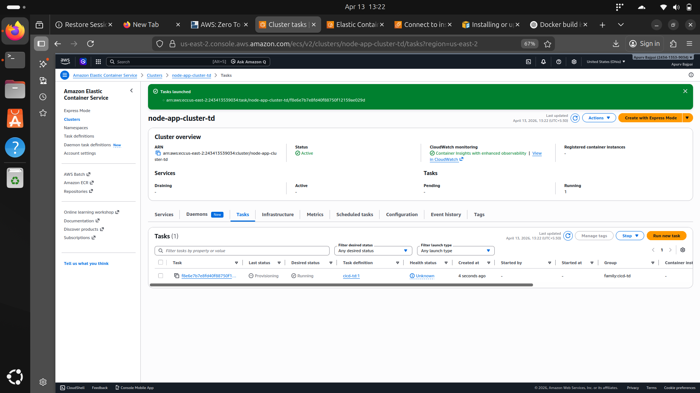
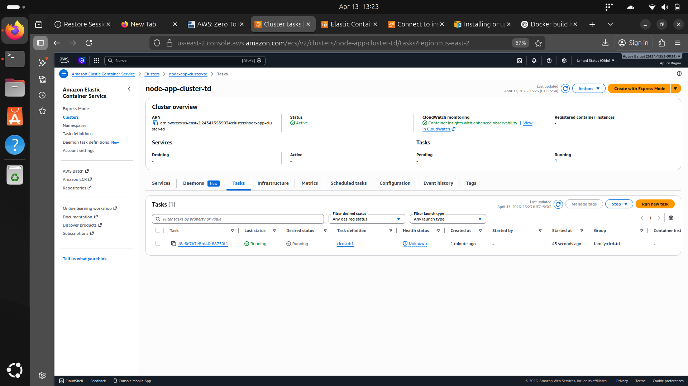
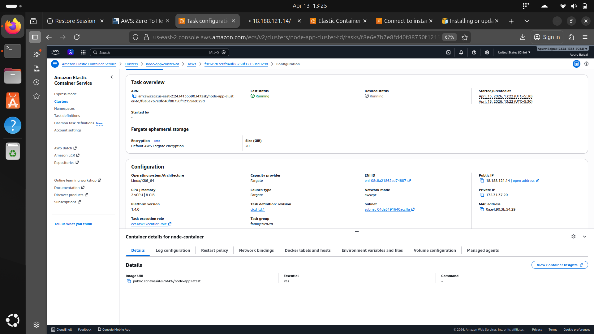
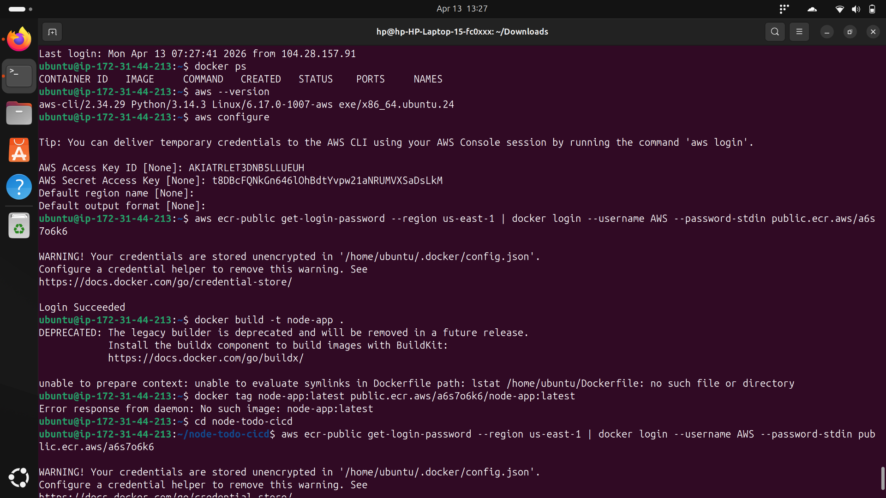
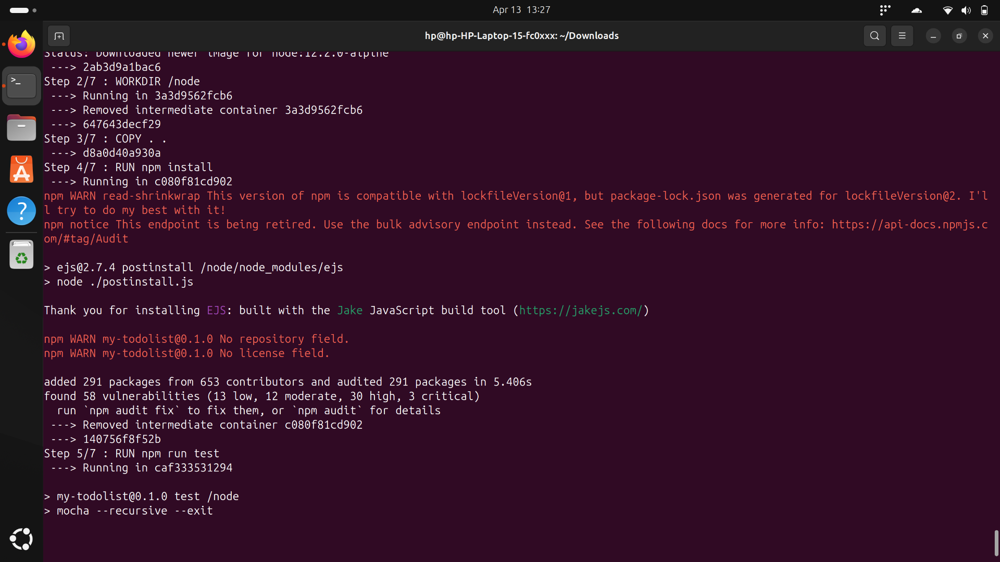
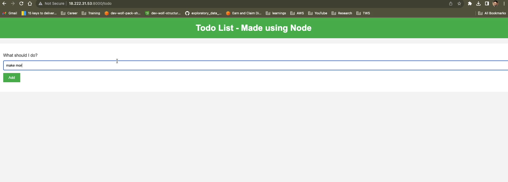
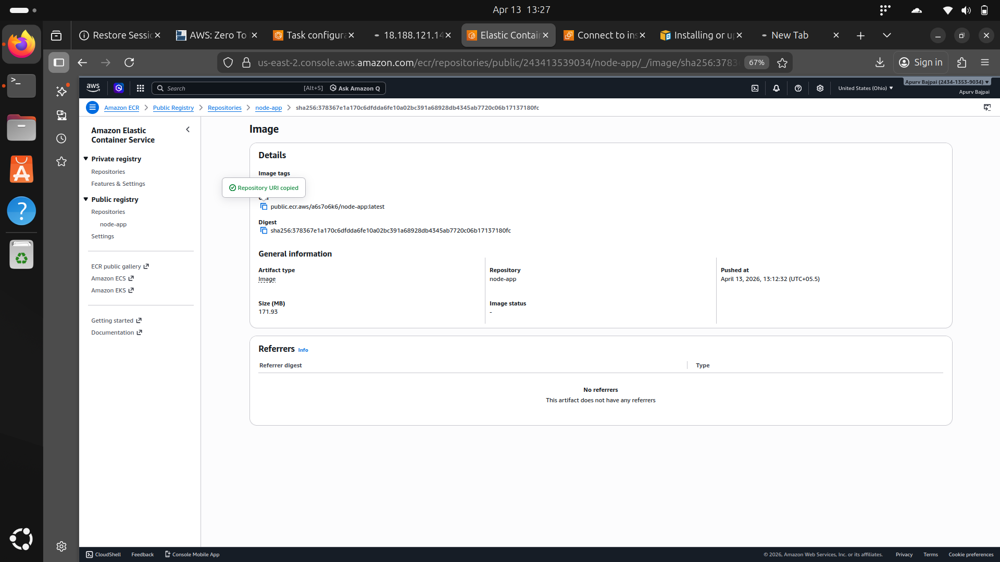

# nodejs-todo-aws-ecs-cicd
# 🚀 Node.js Todo App - AWS ECS CI/CD Deployment

# 📌 Project Overview

This project demonstrates an end-to-end DevOps workflow by deploying a Node.js Todo application using Docker and AWS services like ECR and ECS (Fargate).

---

# 🛠️ Tech Stack

* Node.js
* Docker
* AWS EC2
* AWS ECR (Elastic Container Registry)
* AWS ECS (Fargate)
* IAM (Roles & Permissions)

---

# ⚙️ Deployment Workflow

# 1️⃣ Clone the Repository

```bash
git clone https://github.com/LondheShubham153/node-todo-cicd.git
cd node-todo-cicd
```

# 2️⃣ Build Docker Image

```bash
docker build -t node-app .
```

# 3️⃣ Tag Docker Image

```bash
docker tag node-app:latest <your-ecr-repo-uri>:latest
```

# 4️⃣ Authenticate with AWS ECR

```bash
aws ecr-public get-login-password --region us-east-1 \
| docker login --username AWS --password-stdin public.ecr.aws/<your-id>
```

# 5️⃣ Push Image to ECR

```bash
docker push <your-ecr-repo-uri>:latest
```

# 6️⃣ Deploy to ECS (Fargate)

* Create ECS Cluster
* Create Task Definition
* Add container image (from ECR)
* Configure CPU/Memory
* Run task using Fargate

---

# 🌐 Application Access

Once deployed, access the application using:

```
http://<ecs-public-ip>:3000
```

---

# 📸 Screenshots

# ECS Cluster


# ECS Task Definition


# ECR Repository


# ECS Service


# ECS Networking


# ECS Running Task


# Application UI

---

# 🔐 IAM Role Configuration

Created an IAM Role with:

* AmazonEC2ContainerRegistryFullAccess
* AmazonECS_FullAccess

---

# 🚧 Challenges Faced

* Dockerfile not found error (fixed by correct directory navigation)
* ECR authentication setup
* Port exposure and security group configuration

---

# 🎯 Key Learnings

* Containerization using Docker
* Image management with AWS ECR
* Serverless container deployment with ECS Fargate
* IAM roles and permissions handling

---

# 🔥 Future Improvements

* Add Application Load Balancer (ALB)
* Implement CI/CD using GitHub Actions
* Add HTTPS using AWS ACM
* Auto Scaling setup

---

# 📬 Author

**Apurv Bajpai**

---

# ⭐ Give a Star

If you found this project useful, consider giving it a ⭐ on GitHub!
